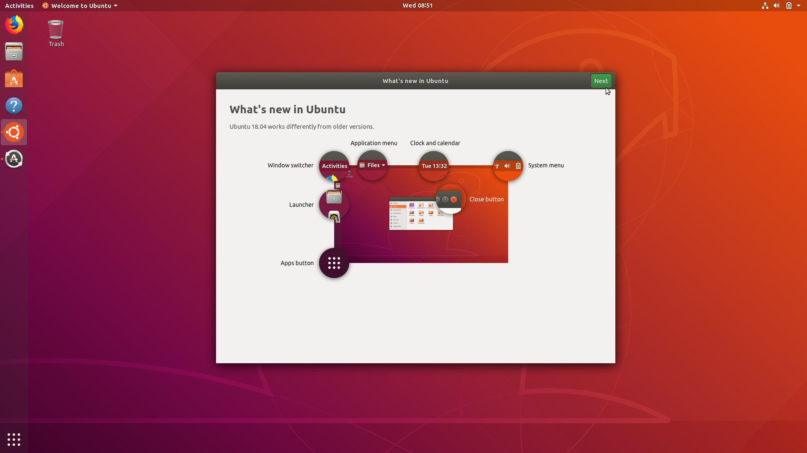
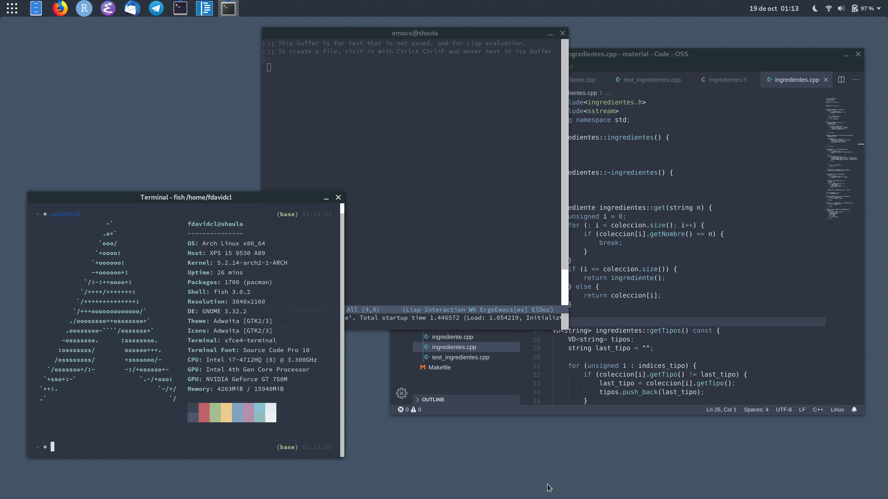
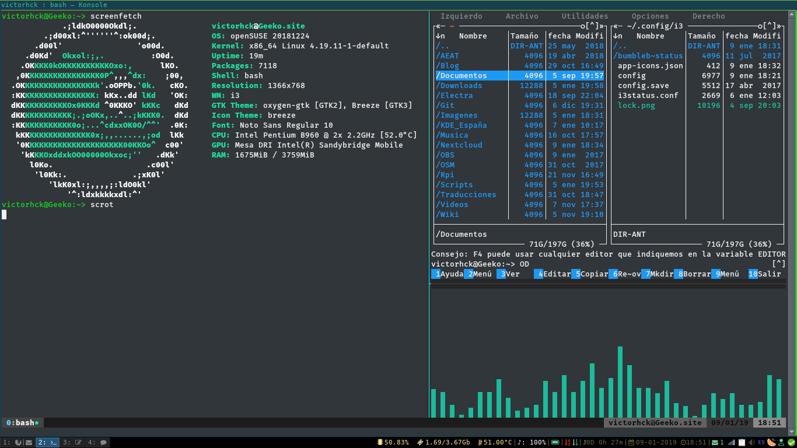
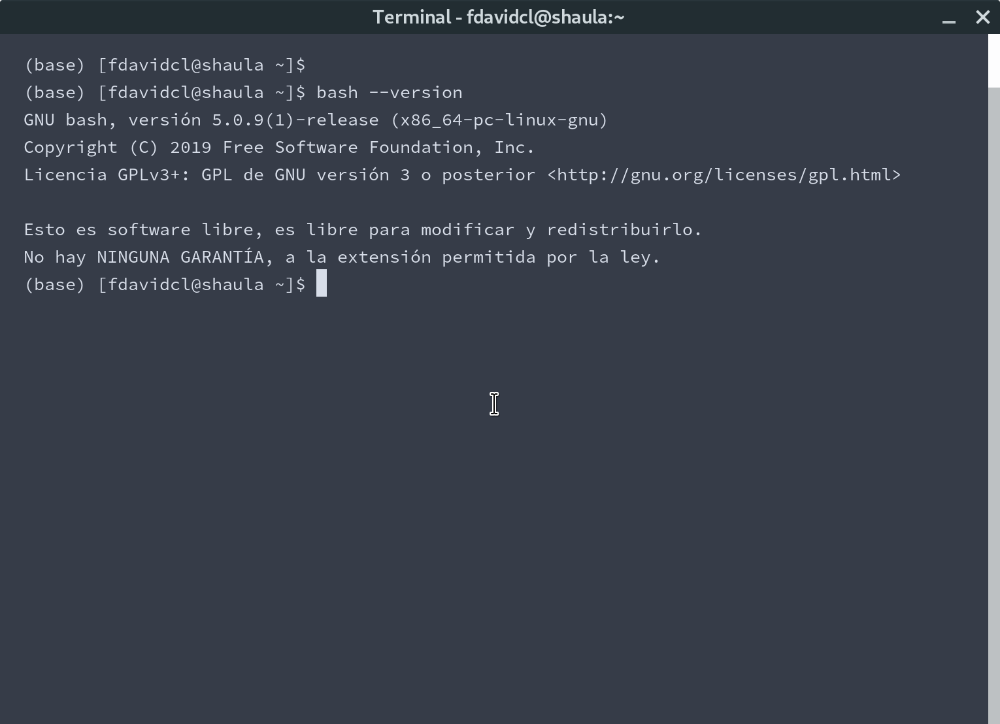
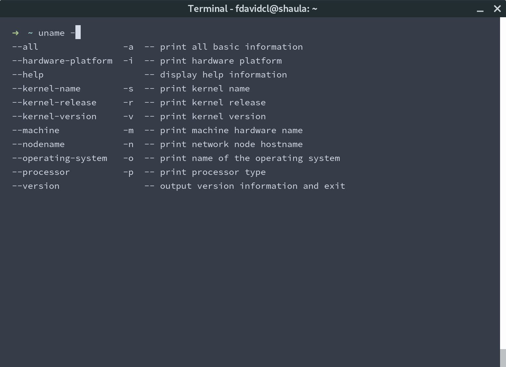
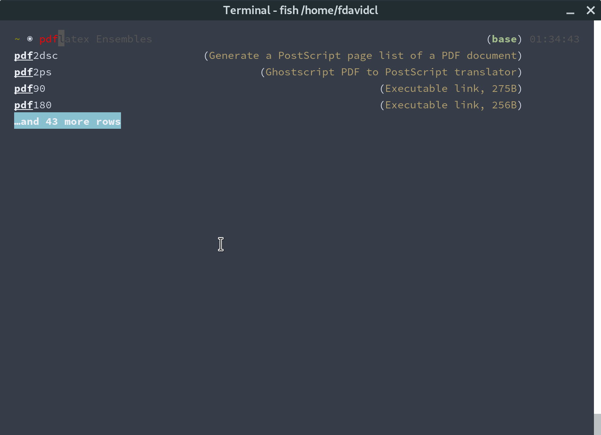
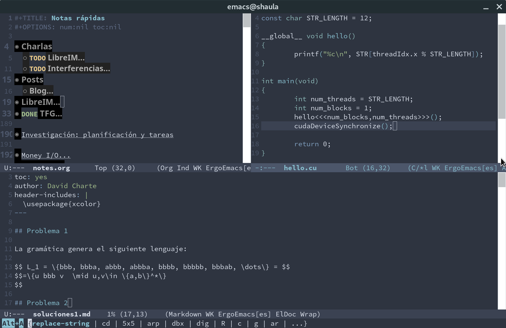
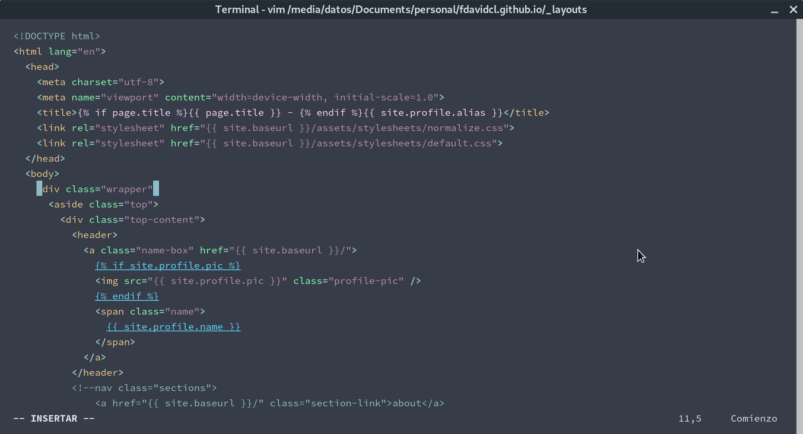

# Linux

## Un sistema operativo libre

\begin{figure}\centering\small
\begin{tikzpicture}[node distance=0cm]
\node[layer,minimum width=10cm] (a) {Linux (kernel)};
\node[layer,above left=0cm and -5cm of a] (b) {GNU};
\node[layer,above=of b] (f) {Bash/zsh/fish (shell)};
\node[layer,above right=0cm and -5cm of a] (c) {X/Wayland (graphical server)};
\node[layer,above=of c] (d) {GNOME/KDE/i3... (DE/WM)};
\node[layer,above=of d] (e) {Emacs/Firefox... (apps)};
\end{tikzpicture}
\end{figure}

# Flame wars

## ubuntu \textcolor{gray}{VS arch}

## \textcolor{gray}{ubuntu VS} arch

## \textcolor{gray}{tiling VS} **stacking**

## tiling \textcolor{gray}{VS stacking}

## bash \textcolor{gray}{VS zsh}

## \textcolor{gray}{bash VS} zsh

## \textcolor{gray}{bash VS zsh VS} fish

## emacs \textcolor{gray}{VS vi(m)}

## \textcolor{gray}{emacs VS} vi(m)

## Resumen: desarrollo en Linux

1. escoge una **distro** "ya preparada" (Ubuntu, Mint)  
   o instala de cero (Arch)
2. aprende a usar la **terminal** ([$\nearrow$ chuleta de bash](https://duckduckgo.com/?q=bash+cheatsheet&t=ffab&ia=cheatsheet&iax=1))
3. prepara un **editor** para trabajar con C++, \LaTeX
4. sincroniza tus proyectos con **git**

# Licencias

## código abierto (open source)

**Open Source Definition (Open Source Initiative)**

Licencias **permisivas**:

- Apache
- BSD 2/3-clause
- MIT
- Do What The F*ck You Want To

Equivalente en obras: CC BY

## código libre (free software)

**Free Software Foundation**

1. Uso
2. Copia
3. Modificación
4. Distribución

Licencias con **copyleft**:

- GPL(v2, v3)
- AGPLv3
- Mozilla PL

Equivalente en obras: CC BY-SA

## código con Commons Clause

Cláusula Commons:  

*the License does not grant to you*  
*the right to Sell the Software*

No permiten vender $\Rightarrow$ **no son libres**

Equivalente en obras: CC BY(-SA)-NC

## privativa, código publicado

Código público (en GitHub/Gitlab) **no significa libre**

Licencias:

- (ninguna)
- licencias privativas