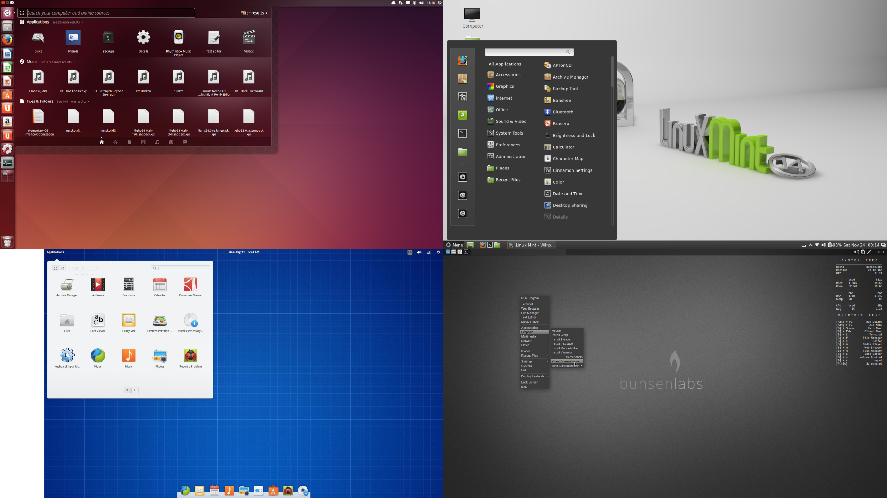

# Linux

## Distros

* Hay **muchas**, pruébalas (modo Live)

* También puedes elegir entorno de escritorio (GNOME, KDE, Cinnamon...)

* Tener un entorno de desarrollo a tu gusto es importante

## Ubuntu

. . .

* La más usada y la más fácil de usar

* Variantes: **Linux Mint**, **Elementary**

## Arch

* Rolling Release: Siempre actualizada

* Documentación &rarr; &infin; (Arch Wiki)

* Variantes: **Antergos**, **Manjaro**

## La terminal

* Atajos útiles: &uarr;, &#8633;, Ctrl+R

* Tiene más posibilidades que la GUI

* [Cheatsheet](https://duckduckgo.com/?q=linux+cheatsheet&t=h_&ia=cheatsheet&iax=1)

### tutorials/terminal.sh

## El editor

# LaTeX

## vs. Word, ODT

* $\mathrm\LaTeX$ es texto plano

* Nivel de detalle mucho mayor

* Es extensible, hay paquetes para todo

* Está en la web: **MathJax**

* Para empezar: **TeXstudio**

* **TeXLive** (Linux), [MiKTeX](http://miktex.org/) (Windows),
    [MacTeX](https://www.tug.org/mactex/) (OS X), [Overleaf](https://www.overleaf.com/)

## Cómo escribir LaTeX

* Comandos:  
    `\`*nombre*`[`*opciones*`]{`*parámetro1*`}{`*parámetro2*`}`...
* Entornos: delimitados con `\begin{entorno}` y `\end{entorno}`
* Ecuaciones: \$e^{i \\pi} + 1 = 0\$ &rarr; $e^{i \pi} + 1 = 0$ 
* Presentaciones: [libreim/beamer](https://github.com/libreim/beamer)

[LaTeX Wikibook](https://en.wikibooks.org/wiki/LaTeX)

[M42/plantillas](https://github.com/M42/plantillas), 
[andreshp/LatexTemplates](https://github.com/andreshp/LatexTemplates)

[Detexify](http://detexify.kirelabs.org/classify.html),
[HostMath](http://hostmath.com/)

### tutorials/ejemplo.tex

# Git + GitHub

## Git

* Es un sistema de control de versiones

* Trabajar con varias personas (sin machacar código)

* Retroceder a una versión anterior del código

* Separar el trabajo en un proyecto por ramas

[Try Git](https://try.github.io/levels/1/challenges/1), [Git cheatsheet](https://duckduckgo.com/?q=git+cheatsheet&t=h_&ia=cheatsheet&iax=1)

### tutorials/git-github.md

## Comandos de Git

* `git init` inicializa un repo

    `git clone` clona uno existente

    `git pull` trae cambios del *remoto*

* `git add` selecciona archivos modificados (y `git reset` los deselecciona)

    `git commit` confirma cambios en los archivos

    `git push` envía cambios desde el *local*

* `checkout`, `merge`, `diff`, `log`, `revert`...

## GitHub

* Alojamiento de repos públicos

* [GitHub Education](http://education.github.com/): repos privados infinitos y más cosas

* Organizaciones: [/libreim](http://github.com/libreim)

* Es vuestro currículum en empresas tecnológicas

# Programación

## Software libre

* Código abierto? Software libre?

* Tipos de licencias: copyleft

* GPL, MIT, Creative Commons

[Free Software Foundation](https://fsf.org)

[Open Source Initiative](https://opensource.org/)

## Lenguajes

* Uno de bajo nivel (**C++**)

* Uno de scripting (**Ruby**, **Python**, **JavaScript**)

* Análisis de datos? **R**, **Scala**

* Programación funcional? **Haskell**

# Recursos y proyectos

## LibreIM

¡**Seminarios**!

[Overflow](https://tux.ugr.es/dgiim/overflow),
[Awesome](https://tux.ugr.es/dgiim/awesome),
[Blog](https://tux.ugr.es/dgiim/blog)

[\@libreim_](https://twitter.com/libreim_)

Telegram: [libreim](https://telegram.me/libreim)

GitHub: [libreim](https://github.com/libreim)

## Oficina de Software Libre

* **#JuevesEnLaETSIIT**

* Certamen de Proyectos Libres

* Talleres, Hackathones...

* [\@oslugr](https://twitter.com/oslugr), [osl.ugr.es](http://osl.ugr.es)

## Otros

* **Granada Hacklab**/**Granada Geek**

* [Python Granada](http://www.python-granada.es/)

* [Interferencias](http://interferenciasenlared.tumblr.com/)

* [AMAT](http://www.ugr.es/~amat)

* [GDG Granada](http://gdggranada.com/)

## {.titleslide#backslide}

<!--link href='http://fonts.googleapis.com/css?family=Open Sans:400,300,700' rel='stylesheet' type='text/css'-->

